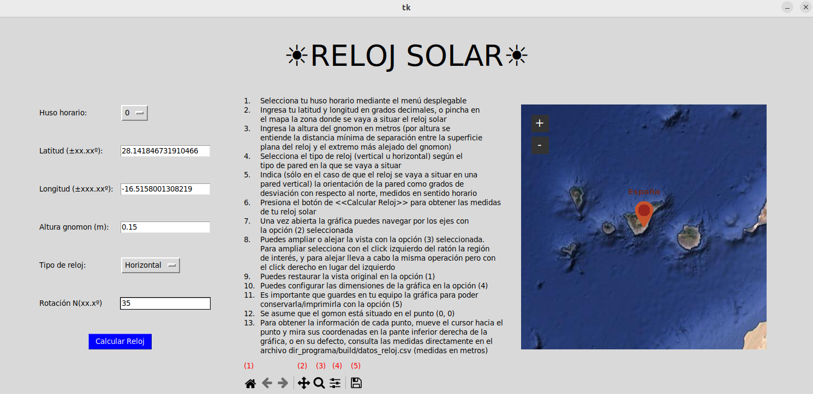
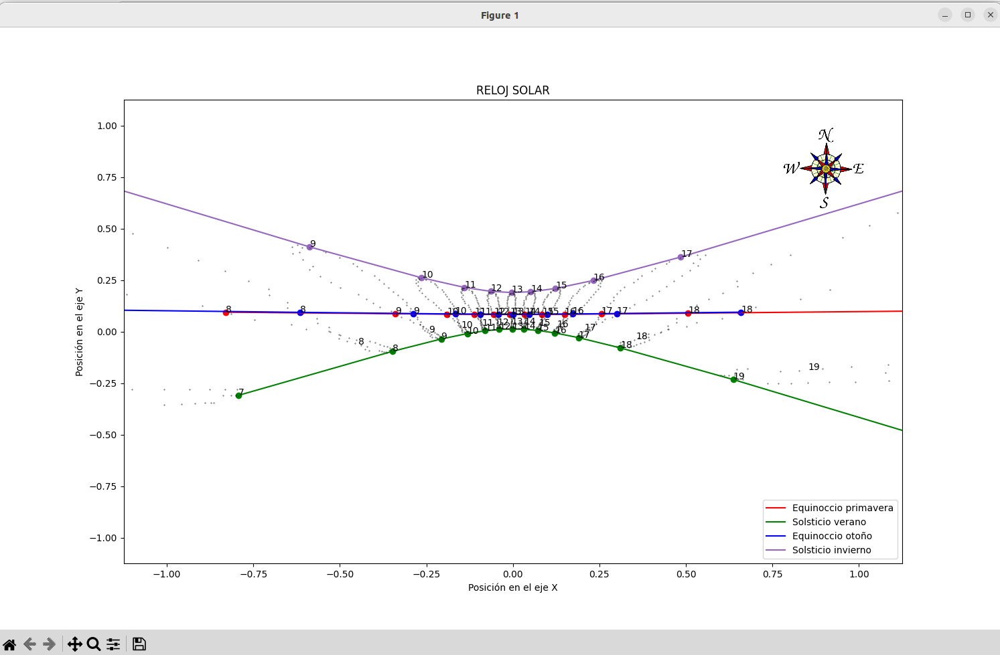

# :sunny:RELOJ-CALENDARIO SOLAR:sunny:
## Summary of the project
Sundial calculator, which also indicates the season of the year, at any given location, built in a horizontal plane or at a wall with any orientation. Instructions are included in the main program tab.
## Installation
Just available for most Linux distributions for the moment. To install the program you just need to download into your local machine the repo, navigate to the directory: {PARENT_FOLDER}/dist/ and execute in the bash terminal: ./gui
## Usage
To use the sundial calculator, just navigate in the map to the location where the instrument will be built, specify the timezone, height of the gnomon, orientation of the wall, and just click the "Calculate button"! :metal:
A new tab will appear with the meassurements of the sundial, which can be saved into your local computer.\
**_Important_ to use the program with internet connection, so that the maps can be loaded**:exclamation:\
The .csv file outputs the meassurements of the instrument, specifying the season of each projection curve as the day number of the year in the "Id" column\
\
\
## Code and project details
The code is well documented, and free to use for modifications and improovements. All calculations are held by c++ programs, but the gui is developed using Python3. It is recommended the usage of a virtual environment to encapsule the Python requirements. To download the requirements, type into your terminal (in the parent folder of the project):
```
pip install -r requirements.txt
```
## Directory structure
The source code of the project is in the src/ directory, where the c++ class and definitions of it's attributes is defined, as well as the main c++ script which invoques the class. Furthermore, in this directory, Python source files are included, and some images wich are needed for the gui. In the build directory the binary executables of the cpp files are located, as well as the .csv files whish serve as output for the program, where the info for the sundial building will be stored.
